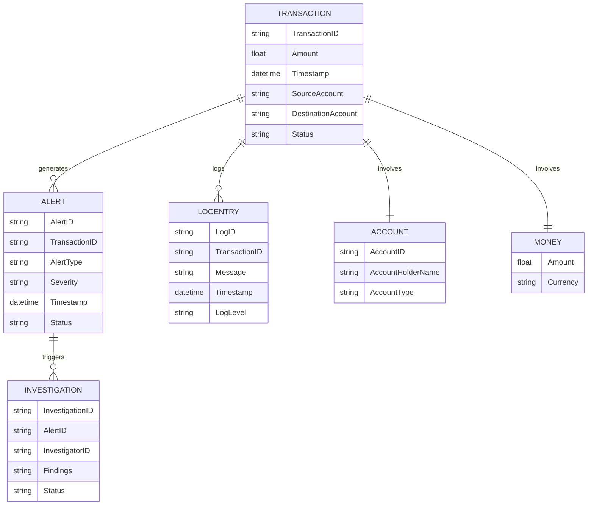

## Transaction Monitoring

```mermaid
erDiagram
    TRANSACTION {
        string TransactionID
        float Amount
        datetime Timestamp
        string SourceAccount
        string DestinationAccount
        string Status
    }
    ALERT {
        string AlertID
        string TransactionID
        string AlertType
        string Severity
        datetime Timestamp
        string Status
    }
    LOGENTRY {
        string LogID
        string TransactionID
        string Message
        datetime Timestamp
        string LogLevel
    }
    INVESTIGATION {
        string InvestigationID
        string AlertID
        string InvestigatorID
        string Findings
        string Status
    }
    ACCOUNT {
        string AccountID
        string AccountHolderName
        string AccountType
    }
    MONEY {
        float Amount
        string Currency
    }

    TRANSACTION ||--o{ ALERT : generates
    TRANSACTION ||--o{ LOGENTRY : logs
    ALERT ||--o{ INVESTIGATION : triggers
    TRANSACTION ||--|| ACCOUNT : involves
    TRANSACTION ||--|| MONEY : involves
```